Alright — let’s make this **completely different style README** (not typical boring one).
This will look like a **portfolio + story + premium GitHub project** 🔥

👉 Copy–paste this:

---

# 🧬 SQL LAB: DATA STORY ENGINE

### *Turning raw tables into meaningful insights*

---

## 🎯 What is this?

This is not just a SQL project.

This is a **data story system** where:

* 👤 Customers → People
* 🛒 Orders → Behavior
* 👨‍💼 Employees → Organization

And SQL is used as a **tool to uncover patterns**.

---

## 🧩 Data Model Snapshot

```
customers ─────┐
               ├──▶ orders
employees ─────┘
```

📌 Relationships:

* One customer → many orders
* Employees → independent analysis

---

# 🎥 VISUAL OUTPUT WALKTHROUGH

---

## 🟢 Step 1 — Raw Relationship View

👉 “Who ordered what?”

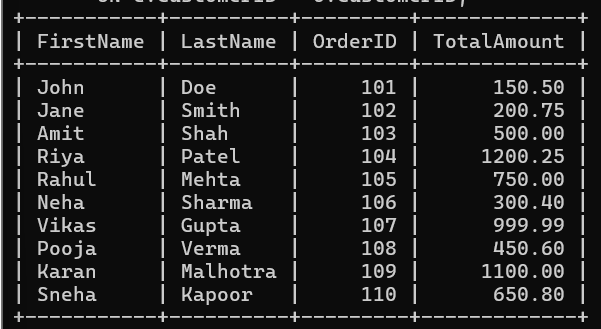

---

## 🔵 Step 2 — Inclusive Customer View

👉 “Show all customers (even silent ones)”

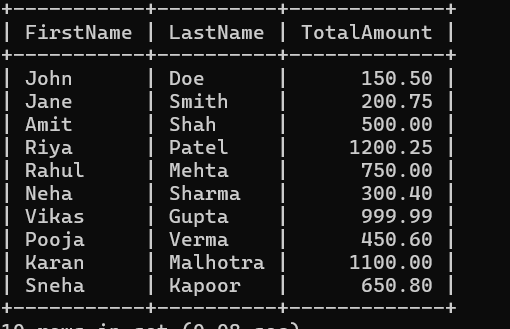

---

## 🔴 Step 3 — Order-Centric View

👉 “Every order must appear”

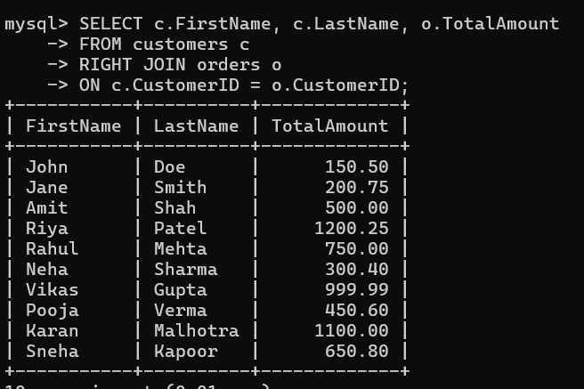

---

## 🟣 Step 4 — Complete Universe (FULL JOIN)

👉 “Nothing should be missed”

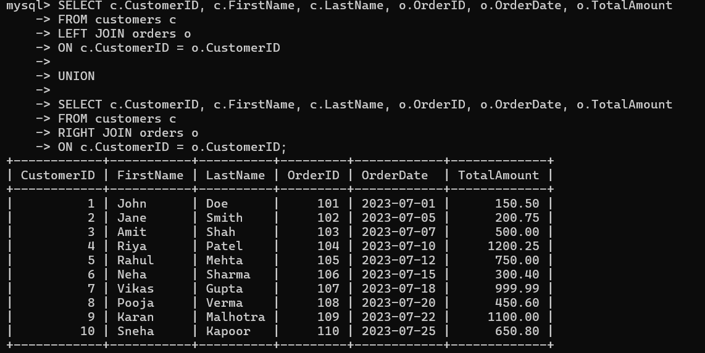

---

## 🟡 Step 5 — Smart Filtering

👉 “Who spends above average?”

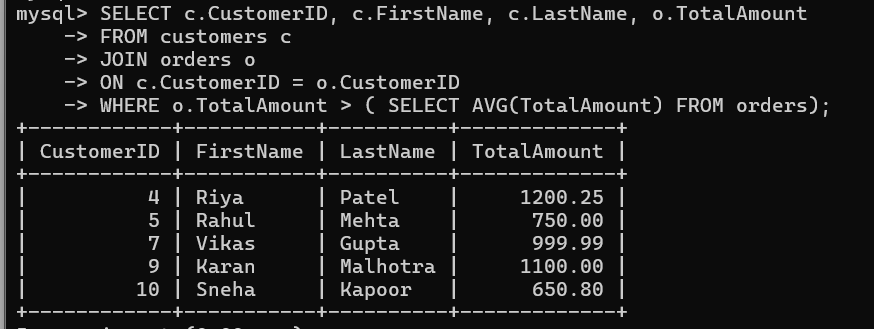

---

## 🟠 Step 6 — Salary Intelligence

👉 “Who earns more than average?”

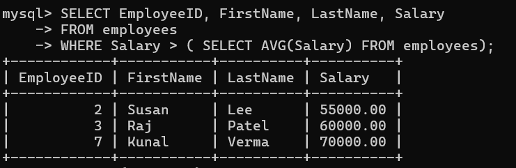

---

## 🟤 Step 7 — Time Breakdown

👉 “Understand data in time dimension”

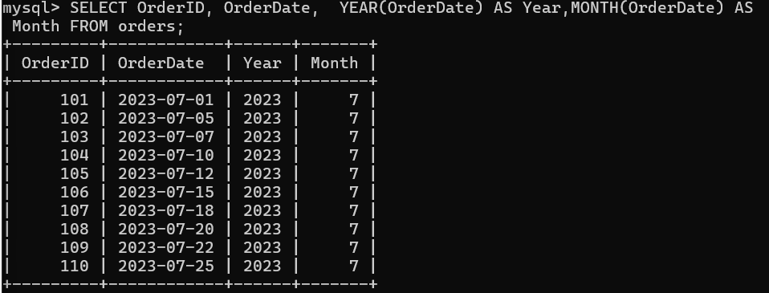

---

## ⚫ Step 8 — Time Distance

👉 “How old is each order?”

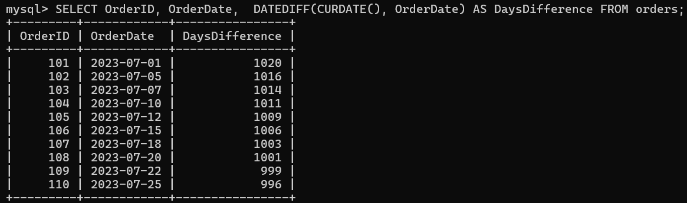

---

## ⚪ Step 9 — Human Friendly Dates

👉 “Readable format”

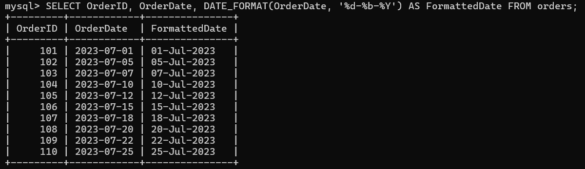

---

## 🔷 Step 10 — Identity Building

👉 “Create full names”

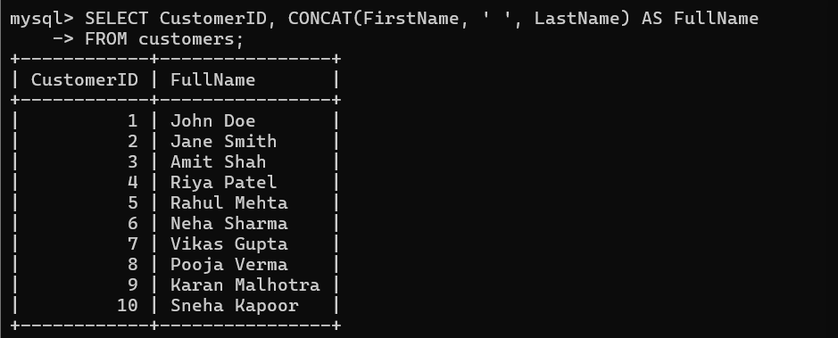

---

## 🔶 Step 11 — Data Cleaning

👉 “Fix inconsistent values”

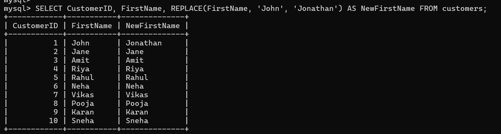

---

## 🔺 Step 12 — Case Conversion

👉 “Standardize format”

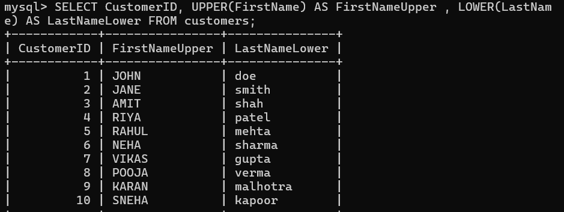

---

## 🔻 Step 13 — Remove Noise

👉 “Trim unwanted spaces”

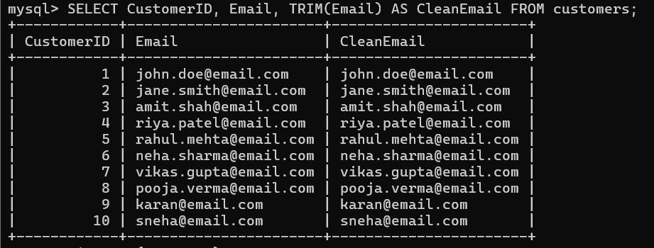

---

## 🔳 Step 14 — Running Total

👉 “Track growth over time”

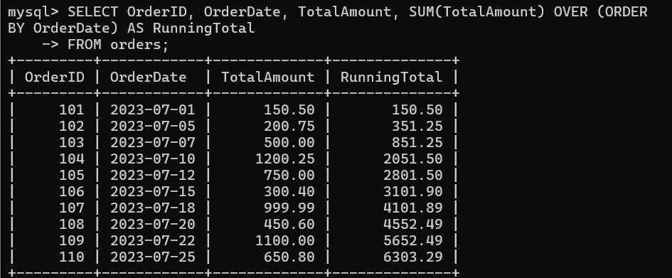

---

## 🔲 Step 15 — Ranking Engine

👉 “Top vs Bottom orders”

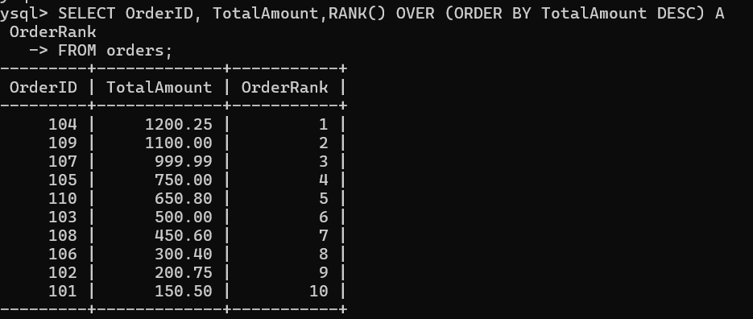

---

## 🟩 Step 16 — Business Logic

👉 “Apply discount rules”

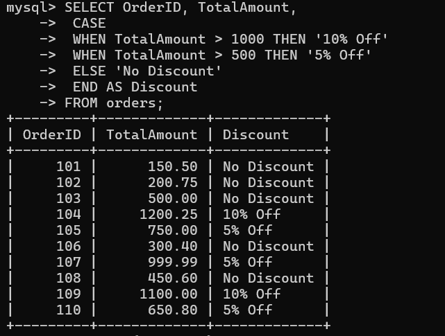

---

## 🟥 Step 17 — Salary Classification

👉 “Segment employees”

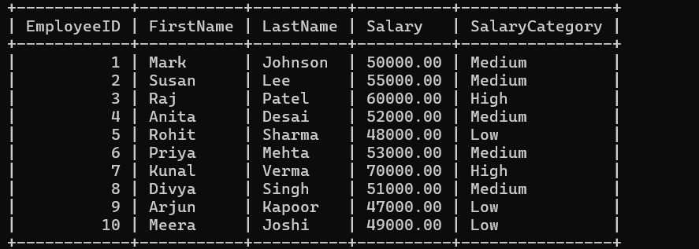

---

# ⚙️ CORE SQL LOGIC (SIMPLIFIED)

---

## 🔗 Joins = Data Connection

* INNER → Only matches
* LEFT → Keep all customers
* RIGHT → Keep all orders
* FULL → Combine everything

---

## 🧠 Subqueries = Smart Filters

Used when:

* Comparing with average
* Dynamic conditions

---

## 🕒 Date Functions = Time Intelligence

* YEAR(), MONTH()
* DATEDIFF()
* DATE_FORMAT()

---

## 🔤 String Functions = Data Cleaning

* CONCAT → Merge text
* REPLACE → Fix values
* TRIM → Remove spaces
* UPPER/LOWER → Standardize

---

## 📊 Window Functions = Advanced Analytics

* Running Total
* Ranking

---

## 🧮 CASE = Decision Making

Used for:

* Discounts
* Salary category

---

# 🚀 WHY THIS PROJECT IS POWERFUL

This project shows:

✔ Real-world SQL thinking
✔ Data transformation skills
✔ Business logic implementation
✔ Analytical mindset

---

# 🧠 WHAT YOU LEARN

After this project you understand:

* How data is connected
* How to filter meaningful insights
* How to format raw data
* How to apply logic like real companies

---

# 📁 DATA SOURCE

SQL file used:
📄 

---

# 🔥 FINAL NOTE

This is not just SQL practice.

This is:

> 💡 “From data → to decision → to understanding”

---

# 👨‍💻 AUTHOR

**Dhruv Prajapati**

---


